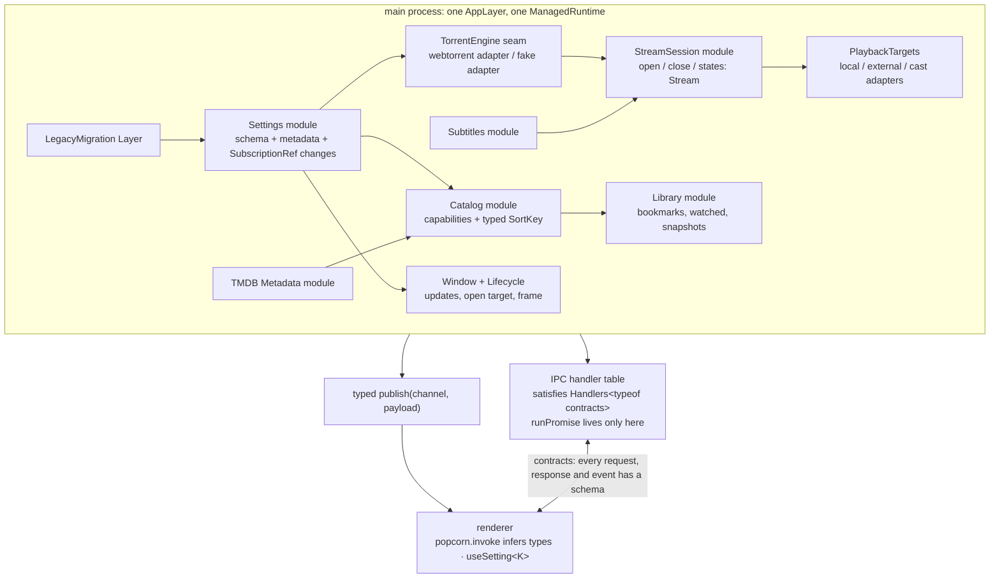
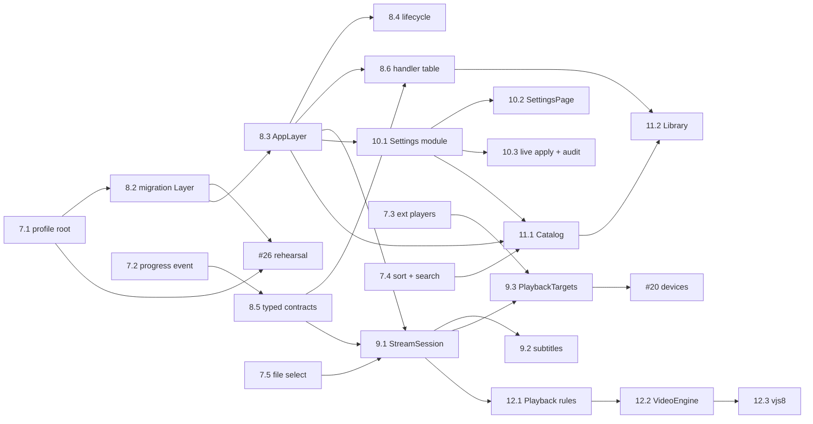

# Port plan: architecture deepening and correctness (Phases 7–13)

This plan follows `plan.md` (Phases 0–6). Phases 0–6 moved Popcorn Time from NW.js/Backbone (`src/app`) to Electron + TypeScript + Effect + React (`src/main`, `src/preload`, `src/shared`, `src/renderer`). An audit on 22–23 Sep 2026 found that the port has the right shape but misses intent in several places:

- Startup order bugs.
- An IPC seam that is only typed on one side.
- Playback knowledge split across the seam.
- Settings spread over four files.
- Providers guessing at each other's semantics.

This plan fixes the user-visible bugs first. It then deepens the modules so the same class of bug can't come back.

Every unit of work is a GitHub issue on `Daelars/popcorn-desktop`. **The issues are the source of truth for status**; this file is the map and the rationale. The tracking issue is **#33**.

---

## 1. For the next agent: how to work this plan

1. **Pick a ticket.**
   - List the open children of #33.
   - Drop any that have an open blocker (GitHub shows "Blocked by") or an assignee.
   - Take the lowest phase number first.
   - Claim it with `gh issue edit <n> --add-assignee @me`.
2. **Read before you touch code.**
   - Read `AGENTS.md`, the ticket, this file's section for the ticket's phase, and the files the ticket lists under *References*.
   - If `CONTEXT.md` or `docs/adr/` exist, read them too. Phase 8.2 creates them.
3. **Stay inside the ticket.** If you find adjacent problems, open a new issue labelled `needs-triage` and link it from the ticket. Don't widen the diff.
4. **Verify cheaply first**, in this order:
   - `pnpm typecheck`
   - `pnpm lint`
   - the focused suite, e.g. `pnpm vitest run tests/streams.test.ts`
   - `pnpm test`

   Run `pnpm build` or the app only when the ticket's acceptance criteria need runtime proof. For runtime checks, use `POPCORN_CDP=1` (remote debugging on :9222) and a throwaway `--user-data-dir`. If your shell has `ELECTRON_RUN_AS_NODE=1` set, unset it.
5. **Tests.** Extend the existing files in `tests/`. `AGENTS.md` makes **new test files opt-in**. If a ticket genuinely needs one (every such ticket says so), ask on the ticket and wait for a maintainer to approve. Test behaviour through the module's interface, not its implementation.
6. **Close the loop.**
   - Branch from `electron-rebuild` and open a PR **into `electron-rebuild`** (not `development`) with `Closes #<n>` in the body. `development` is the legacy NW.js line; the rebuild merges there only when it ships.
   - Tick the ticket's acceptance criteria in a comment and paste the verification commands you ran.
   - If you made a decision a later ticket depends on, append one line to *Decisions so far* in #33.
7. **Never:**
   - Change behaviour the legacy app had without saying so in the PR.
   - Add `any`.
   - Throw strings.
   - Call `Effect.runPromise` outside the IPC handler boundary.
   - Import `src/main` from the renderer.

### Definition of done (every ticket)

- [ ] All acceptance criteria are met and shown in the PR (commands, output, screenshots where the change is visible).
- [ ] `pnpm typecheck`, `pnpm lint` and `pnpm test` pass.
- [ ] The `AGENTS.md` main-process rules still hold (Layers from one root, `runPromise` only at the IPC boundary, tagged errors, `Scope` for resources).
- [ ] Comments next to changed code are updated. Any legacy behaviour that was deliberately dropped is written down in the PR.

---

## 2. Where things stand (evidence)

### 2.1 Verified bugs

Each was checked twice against the code. Line numbers are as of 23 Sep 2026.

| # | Bug | Where | Ticket |
|---|---|---|---|
| 1 | Progress events lack `infoHash`, so the bridge's `decodeUnknownSync` throws on every event and no speed, peers or % appears anywhere | `main/streams.ts:81`, `main/torrent.ts` (`TorrentProgress`), `shared/ipc.ts:340`, `shared/bridge.ts:48`, `main/index.ts:268` | 7.2 |
| 2 | The update check and the first-launch open target are registered only inside `app.on('activate')`, which only fires on macOS | `main/index.ts:571-584` | 8.4 |
| 3 | `migrateLegacy` throws inside `Effect.sync`. That's a defect, so `catchAll` never runs and startup rejects | `main/index.ts:221-235`, `main/migration.ts` | 8.2 |
| 4 | The settings snapshot is read before migration runs, so migrated settings are ignored on first launch | `main/index.ts:189-193` vs `:221` | 8.2 |
| 5 | Wrong legacy profile root. The real data is at `%LOCALAPPDATA%\Popcorn-Time\User Data\Default\data\{bookmarks,settings,watched}.db` plus `…\data\TorrentCollection`; the code reads `%LOCALAPPDATA%\Popcorn-Time\data`. **Confirmed on a real 0.5.1 profile** | `main/index.ts:59-62`, `main/migration.ts` | 7.1 |
| 6 | Choosing a named external player (e.g. `VLC`) leaves the app on the loading screen forever | `renderer/components/PlayerChooser.tsx:54`, `renderer/routes/PlayerPage.tsx:115,228` | 7.3 |
| 7 | `switchesOf` splits `--sub-file=` and its path into two arguments, and quoted values keep their quotes | `main/players.ts:121-125` | 7.3 |
| 8 | `players:play` waits for the player to exit and swallows errors, and the stream is never stopped | `main/players.ts:266-277` | 7.3 |
| 9 | Sorter key and value are inverted (`{Trending:'popularity'}`, but the UI sends the key and the provider compares against the value), so every sort falls back to popularity | `main/providers/tmdb.ts:165,243`, `piratebay.ts:332`, `nyaa.ts`, `renderer/components/FilterBar.tsx:78` | 7.4 |
| 10 | `select(i)` without deselecting first, so playing one episode downloads the whole season pack | `main/webtorrent-engine.ts:75` | 7.5 |
| 11 | Subtitle search uses the IMDb id only, so shows get the wrong episode and non-srt results become empty VTT | `main/subtitles/opensubtitles.ts:156` | 9.2 |
| 12 | TMDB browse ignores `filters.keywords`, so search does nothing on the default source | `main/providers/tmdb.ts` | 7.4 |
| 13 | Show detail's `QualitySelector` has no `key`, so Watch Now does nothing after an episode change | `renderer/components/ShowDetail.tsx`, `QualitySelector.tsx` | 7.6 |
| 14 | `nativeWindowFrame` hides the custom titlebar, but `frame:false` is hard-coded, which leaves a frameless window with no controls | `renderer/App.tsx`, `main/index.ts:143` | 8.4 |
| 15 | The disclaimer fails open when its status IPC errors, and migrated users see it again | `renderer/routes/DisclaimerPage.tsx` | 7.6 |
| 16 | "Upload speed" shows total bytes uploaded | `renderer/components/LoadingScreen.tsx`, `Player.tsx` | 7.6 |
| 17 | Next episode, then close, replays the previous episode (`navigate` pushes, so `-1` returns to the old `/player` URL) | `renderer/routes/PlayerPage.tsx:107` | 7.6 |

### 2.2 Structural findings (why the bugs happened)

- **Composition root.**
  - `main/index.ts` (596 lines) builds `players`, `search`, `updates`, `window` and `files` as object literals outside the Layer graph.
  - It calls `runPromise` about 9 times.
  - It builds a throwaway `settingsProbe` runtime to read settings before `WebTorrentEngineLive`, and builds the provider registry from `POPCORN_*_API` env vars.
  - Startup order is spread over three places. Bugs 2, 3, 4 and 14 live here.
- **IPC seam.**
  - `browse:fetch`, `browse:filters` and `settings:get` respond with `Schema.Unknown`, and `settings:set` is `{key: String, value: Unknown}`.
  - Push events use raw `webContents.send` (4 call sites), and `createEventPublisher` (`main/ipc.ts:458`) is unused. Bug 1 got through because of this.
  - `main/ipc.ts` is a 50-case switch that also holds business logic: `cachePage` at `:410`, `collection:import`, the TMDB `api_key` cast at `:229`, subtitle credentials at `:265`, and the `bigPicture` zoom at `:123`.
- **Playback.**
  - The renderer picks files, runs the subtitle flow and uses the loopback port as the session id.
  - `TorrentService` fails the deletion test: it's a pass-through between `StreamManager` and the engine.
  - The legacy loading state machine (`src/app/streamer.js:660-710`: connecting → startingDownload → downloading → waitingForSubtitles → ready | playingExternally) is gone.
- **Settings.** Each key lives in four places: the type in `shared/settings.ts`, the default in `main/settings.ts`, side effects in `main/ipc.ts`, and label, options and conditions in `renderer/routes/SettingsPage.tsx` (1,005 lines). Consumers read a snapshot at boot. About 55 of 130 keys have no reader.
- **Providers.**
  - The renderer decides capabilities by display name (`descriptor.name === 'YTSApi'`).
  - Each provider defines its own sort semantics.
  - TMDB enrichment is copied into `piratebay.ts`, and the regexes and fake-id helper are copied into `nyaa.ts`.
  - The legacy API providers are registered only through env vars, so the `custom*Server` settings do nothing.
- **Player.** `Player.tsx` (774 lines) mixes seven jobs. The watched, resume and next-episode rules run in effect cleanups. It stays on video.js 4 through `player/legacy-vjs4.ts` (394 lines of prototype patches), although Phase 4.2 planned video.js 8.
- **Library.** Favorites are rebuilt from the browse cache, which `cachePage` overwrites with thin rows. Shows have no watched state. Stand-in providers write fake `tt+infohash` ids into bookmarks and watched.

### 2.3 Visual parity

A runtime side-by-side of 0.5.1 against the port showed that the generated theme CSS is faithful. The remaining drift is in the markup and the base layers. The maintainers judged the UI acceptable for now, so the findings are recorded on #16 (the screenshot parity gate) and in 13.4, and are not scheduled.

---

## 3. Target architecture

Rules the target enforces:

1. **One Layer graph.** Startup order is the dependency graph. Migration runs before Settings is built because Settings depends on it.
2. **The contract is checked at both ends.** A missing field fails `tsc`, not the user.
3. **Deep modules own their decisions.** StreamSession owns file choice, subtitles and loading state. Settings owns metadata and live apply. Catalog owns capabilities and sort semantics. The renderer asks for things; it doesn't orchestrate them.
4. **Seams only where there are two adapters.** TorrentEngine (webtorrent/fake), PlaybackTargets (local/external/cast), VideoEngine (vjs4/vjs8) and Catalog providers (tmdb/apibay/nyaa/legacy APIs) each have at least two.

### Glossary

Phase 8.2 seeds `CONTEXT.md` with these terms:

- **StreamSession**: one playing torrent or local file, from `open` to `close`, with a stream of states (the legacy set: `connecting → startingDownload → downloading → waitingForSubtitles → ready | playingExternally`, then `closed | failed`).
- **PlaybackTarget**: where a session plays: `local`, `external:<player id>`, `chromecast:<id>`, `dlna:<id>`, `airplay:<id>`, `xbmc:<id>`.
- **Catalog**: the browsable sources behind the Movies, Series and Anime tabs, each declaring its capabilities (`search`, `sort: SortKey[]`, `quality`).
- **Library**: the user's bookmarks and watched state, plus the media snapshot each points at.
- **Setting consumer**: a module that subscribes to a setting key. A key with no consumer is inert and must be justified or removed.

---

## 4. Phases and tickets

The issue numbers are the source of truth; ids like "7.1" are stable names for the same work. "Blocked by" is set as native GitHub dependencies on each issue.

### Phase 7: Stabilise (small, surgical fixes; no refactors)

The goal is that core flows work before any refactor starts. Each fix is minimal. Later phases make the same bug impossible by construction.

| Id | Issue | Title | Blocked by |
|---|---|---|---|
| 7.1 | #34 | Fix the legacy profile root so migration finds 0.5.1 data | – |
| 7.2 | #35 | Stream progress events carry `infoHash`, sent through the typed event publisher | – |
| 7.3 | #36 | External players: start, argv and lifecycle | – |
| 7.4 | #37 | Browse: sorter key/value inversion and TMDB keyword search | – |
| 7.5 | #38 | Only the chosen file of a multi-file torrent downloads | – |
| 7.6 | #39 | Renderer correctness: quality selector key, disclaimer fail-open, upload speed, next-episode history | – |

The existing **#26** (migration rehearsal on a real 0.5.1 profile) is now blocked by 7.1 and 8.2.

### Phase 8: Composition root (C1) and the IPC seam (C2)

| Id | Issue | Title | Blocked by |
|---|---|---|---|
| 8.2 | #40 | Migration becomes a Layer that Settings depends on, with typed failures (seeds `CONTEXT.md` and ADR-0001) | 7.1 |
| 8.3 | #41 | One AppLayer: every service is a Layer, one ManagedRuntime, `runPromise` only in IPC handlers | 8.2 |
| 8.4 | #42 | Lifecycle on every platform: update schedule, initial open target, native frame, smoke harness out of `index.ts` | 8.3 |
| 8.5 | #43 | IPC contracts typed in both directions: real response schemas and typed publishing for every event | 7.2 |
| 8.6 | #44 | IPC handler table checked against the contracts; business logic moves into services | 8.3, 8.5 |

Why C1 comes first: four of the worst bugs (2, 3, 4, 14) are ordering mistakes in `index.ts`, and C3, C4, C6 and C7 all need their modules to be Layers first. C2 comes second because it's small and would have caught bug 1 at compile time.

### Phase 9: Playback (C3 StreamSession, C6 PlaybackTargets)

| Id | Issue | Title | Blocked by |
|---|---|---|---|
| 9.1 | #45 | StreamSession module: open/close/states, loading state machine, automatic file choice; TorrentService folded in | 8.3, 8.5, 7.5 |
| 9.2 | #46 | Subtitles inside StreamSession: episode-aware search, srt filter, encoding fallback, default language | 9.1 |
| 9.3 | #47 | PlaybackTargets Layer: local and external adapters on StreamSession; the chooser renders `list()` | 9.1, 7.3 |

The existing **#20** (devices and external players) is now blocked by 9.3. The cast adapters plug into PlaybackTargets.

### Phase 10: Settings (C4)

| Id | Issue | Title | Blocked by |
|---|---|---|---|
| 10.1 | #48 | Settings module: per-key metadata and a change stream | 8.3 |
| 10.2 | #49 | SettingsPage renders from the metadata | 10.1 |
| 10.3 | #50 | Live apply and the inert-key audit | 10.1 |

### Phase 11: Catalog (C7) and Library (C8)

| Id | Issue | Title | Blocked by |
|---|---|---|---|
| 11.1 | #51 | Catalog Layer: declared capabilities, typed SortKey, one TMDB metadata module, custom servers wired | 7.4, 8.3, 10.1 |
| 11.2 | #52 | Library module: bookmarks and watched own their media snapshots, and shows get watched state *(speculative, `needs-triage`)* | 8.6, 11.1 |

### Phase 12: Player (C5)

| Id | Issue | Title | Blocked by |
|---|---|---|---|
| 12.1 | #53 | Playback rules as a pure module: resume, watched, next episode across seasons, autoplay | 9.1 |
| 12.2 | #54 | VideoEngine seam with a video.js 4 adapter | 12.1 |
| 12.3 | #55 | video.js 8 adapter; drop videojs-youtube 1.2.10; CSP check for trailers and blob subtitles | 12.2 |

### Phase 13: Parity backlog (`needs-triage`; scope decided by maintainers)

| Id | Issue | Title |
|---|---|---|
| 13.1 | #56 | Browse and library parity gaps |
| 13.2 | #57 | Seedbox and torrent collection parity gaps |
| 13.3 | #58 | Settings and lifecycle parity gaps |
| 13.4 | #59 | Visual parity follow-ups from the runtime audit |

Existing issues that stay as they are but now have context comments: **#16** (screenshot gate, which got the visual findings), **#23** (Trakt and the JSON-RPC decision; the four JSON-RPC settings are still in the UI), **#27** (security pass: committed API keys in `main/settings.ts`, `sandbox:false`, `setWindowOpenHandler` passing any scheme, the `popcorn/popcorn` default).

### Dependency graph

Phase 7 tickets have no blockers and can run in parallel. After Phase 8, the playback (9, 12), settings (10) and catalog (11) tracks can also run in parallel.

---

## 5. Risks and decisions for the maintainers

- **User data.** 7.1 and #26 come before anything that touches migration. A wrong path loses history silently, and the migration writes a backup but reports no error.
- **Legacy behaviour drift.** Refactors must keep legacy semantics unless the ticket says otherwise. The legacy code is in `src/app`, and each ticket cites the file to compare against.
- **video.js 8 (12.3)** changes the skin. The visual gate (#16) should run before it merges.
- **Speculative work.** 11.2 (Library) and all of Phase 13 carry `needs-triage`. A maintainer decides scope before an agent picks them up.
- **Test files.** Most tickets can extend existing files (`tests/ipc.test.ts`, `streams.test.ts`, `settings.test.ts`, `providers.test.ts`, `migration.test.ts`, `PlayerPage.test.tsx`). Where a new module arguably deserves its own file (StreamSession, Playback rules, Catalog), the ticket asks for approval first, as `AGENTS.md` requires.

## Decisions so far

Also mirrored in #33:

- 2026-09-23: The plan was created from the architecture review and the visual parity audit. The UI is accepted as-is for now; visual findings are parked on #16 and 13.4.
